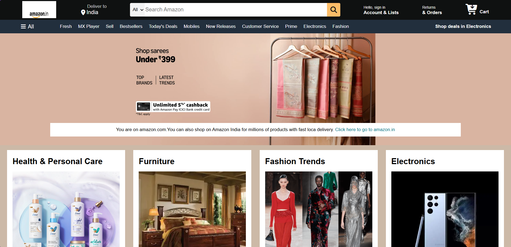

# 🛒 Amazon Clone

A responsive Amazon homepage clone built using HTML5 and CSS3.

## Live Demo

🔗 https://vendiesel1703-moh.github.io/Amazon-Clone/

## Features
- Responsive Amazon-inspired UI
- Navigation Bar
- Search Bar
- Product Categories
- Hero Banner
- Responsive Layout

## Technologies Used
- HTML5
- CSS3
- GitHub Pages

## 📸 Project Preview

## 📂 Project Structure

Amazon-Clone/
├── index.html
├── style.css
├── screenshots/
└── README.md

## 🚀 What I Learned

- HTML5 Semantic Elements
- CSS3 Styling
- Flexbox Layout
- Responsive Web Design
- Navigation Bar Design
- Landing Page Development
- Project Documentation

## 👨‍💻 Author

Mohit Nagdeep
